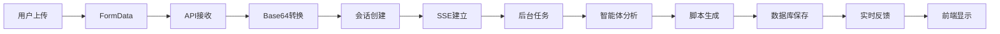

# 图片上传流程快速参考

## 🔄 完整流程概览

```
用户上传图片 → API处理 → SSE建立 → 智能体分析 → 实时反馈 → 数据库保存
```

## 📊 时序图


## 🔑 关键步骤

### 1. 前端上传 (`WebTestCreation.tsx`)
```tsx
// 用户选择图片
handleImageUpload(file) → setUploadedFile(file)

// 提交表单
handleImageAnalysis(values) → FormData → analyzeWebImage(formData)
```

### 2. API接收 (`image_analysis.py`)
```python
@router.post("/analyze/image")
async def start_web_image_analysis(file: UploadFile, ...):
    # 验证 → Base64转换 → 生成session_id
    return {"session_id": session_id, "sse_endpoint": f"/stream/{session_id}"}
```

### 3. SSE建立 (`StreamingDisplay.tsx`)
```tsx
// React状态变化触发SSE连接
useEffect(() => {
    if (sessionId) connectSSE();
}, [sessionId]);

// 建立EventSource连接
const eventSource = new EventSource(`/api/v1/web/create/stream/${sessionId}`);
```

### 4. 后台处理 (`image_analysis.py`)
```python
@router.get("/stream/{session_id}")
async def stream_web_analysis(session_id: str):
    # 启动后台任务
    asyncio.create_task(process_web_analysis_task(session_id))
    
    # 返回SSE流
    return EventSourceResponse(web_event_generator(session_id))
```

### 5. 智能体协作
```python
# 编排器启动
orchestrator.analyze_image_to_scripts()

# 图片分析智能体
image_analyzer.handle_message() → 团队协作分析

# 脚本生成智能体  
yaml_generator.handle_message() → 生成YAML脚本

# 数据库保存智能体
script_database_saver.handle_script_save_request() → 保存到PostgreSQL
```

## 🎯 核心文件

| 组件 | 文件路径 | 主要功能 |
|------|----------|----------|
| 前端上传 | `frontend/src/pages/Web/components/WebTestCreation/WebTestCreation.tsx` | 图片上传和表单提交 |
| SSE显示 | `frontend/src/components/StreamingDisplay/StreamingDisplay.tsx` | 实时消息显示 |
| API端点 | `backend/app/api/v1/endpoints/web/image_analysis.py` | 图片接收和SSE处理 |
| 编排器 | `backend/app/services/web/orchestrator_service.py` | 智能体协调 |
| 图片分析 | `backend/app/agents/web/image_analyzer.py` | AI图片分析 |
| 脚本生成 | `backend/app/agents/web/yaml_generator.py` | YAML脚本生成 |
| 数据库保存 | `backend/app/agents/web/script_database_saver.py` | PostgreSQL保存 |

## 🔧 技术栈

- **前端**: React + TypeScript + Ant Design + EventSource
- **后端**: FastAPI + Python + AsyncIO + SSE
- **AI**: AutoGen + 多智能体协作
- **数据库**: PostgreSQL + SQLAlchemy + AsyncPG
- **通信**: SSE (Server-Sent Events) + JSON

## 📈 数据流



## 🚀 快速调试

### 前端调试
```bash
# 查看SSE连接状态
console.log('SSE连接状态:', connectionStatus);

# 查看会话ID
console.log('当前会话ID:', currentSessionId);
```

### 后端调试
```bash
# 查看活跃会话
curl http://localhost:8000/api/v1/web/create/sessions

# 查看会话详情
curl http://localhost:8000/api/v1/web/create/sessions/{session_id}
```

### 数据库调试
```sql
-- 查看最新脚本
SELECT id, name, session_id, created_at FROM test_scripts ORDER BY created_at DESC LIMIT 5;

-- 查看会话记录
SELECT id, session_type, status, created_at FROM sessions ORDER BY created_at DESC LIMIT 5;
```

## ⚠️ 常见问题

1. **SSE连接失败**: 检查session_id是否有效，后端服务是否正常
2. **图片上传失败**: 检查文件大小（<5MB）和格式（image/*）
3. **分析超时**: 检查AI模型服务是否可用
4. **数据库保存失败**: 检查PostgreSQL连接和表结构

## 📚 详细文档

完整的技术文档请参考: [图片上传到后端完整流程文档](./architecture/image-upload-flow.md)
