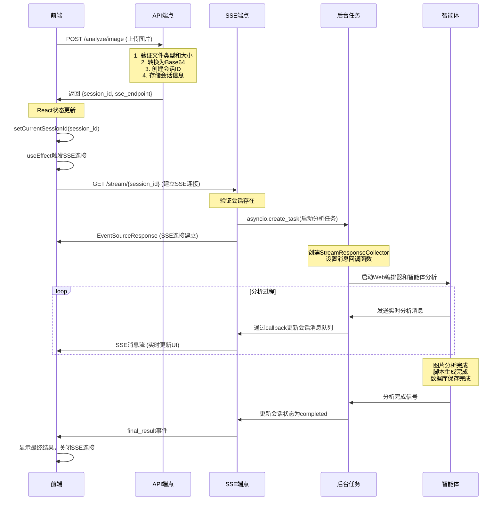

# 图片上传到后端完整流程文档

## 概述

本文档详细描述了从用户上传图片到后端处理的完整执行流程，包括前端交互、API处理、SSE流式响应、智能体协作等各个环节。

## 流程时序图



## 详细流程说明

### 1. 前端用户交互层

#### 1.1 图片上传组件
- **文件**: `frontend/src/pages/Web/components/WebTestCreation/WebTestCreation.tsx`
- **功能**: 处理用户图片上传，验证文件类型和大小
- **关键代码**: `handleImageUpload` 函数

#### 1.2 表单提交处理
- **功能**: 构建FormData，包含图片文件和表单数据
- **关键代码**: `handleImageAnalysis` 函数

#### 1.3 API调用
- **文件**: `frontend/src/services/api.ts`
- **功能**: 发送multipart/form-data请求到后端
- **端点**: `POST /api/v1/web/create/analyze/image`

### 2. 后端API接收层

#### 2.1 路由注册
- **文件**: `backend/app/api/v1/api.py`
- **功能**: 注册Web图片分析路由

#### 2.2 图片分析API端点
- **文件**: `backend/app/api/v1/endpoints/web/image_analysis.py`
- **功能**: 
  - 验证文件类型和大小（5MB限制）
  - 转换图片为Base64编码
  - 生成唯一会话ID
  - 创建分析请求对象
  - 存储会话信息到内存
- **返回**: 包含session_id和sse_endpoint的JSON响应

### 3. SSE流式响应建立

#### 3.1 前端SSE连接
- **文件**: `frontend/src/components/StreamingDisplay/StreamingDisplay.tsx`
- **触发**: React useEffect监听sessionId变化
- **功能**: 创建EventSource连接到SSE端点

#### 3.2 后端SSE端点
- **文件**: `backend/app/api/v1/endpoints/web/image_analysis.py`
- **端点**: `GET /api/v1/web/create/stream/{session_id}`
- **功能**:
  - 验证会话存在
  - 启动后台分析任务
  - 返回EventSourceResponse
  - 设置SSE响应头

### 4. 后台任务和智能体协作

#### 4.1 后台任务启动
- **函数**: `process_web_analysis_task`
- **功能**: 
  - 创建StreamResponseCollector
  - 设置消息回调函数
  - 启动Web编排器

#### 4.2 智能体编排
- **文件**: `backend/app/services/web/orchestrator_service.py`
- **功能**: 协调多个智能体完成图片分析和脚本生成

#### 4.3 图片分析智能体
- **文件**: `backend/app/agents/web/image_analyzer.py`
- **功能**: 
  - 创建多智能体分析团队
  - 运行团队协作分析
  - 整合分析结果
  - 路由到脚本生成智能体

#### 4.4 脚本生成智能体
- **文件**: `backend/app/agents/web/yaml_generator.py`
- **功能**: 
  - 生成YAML测试脚本
  - 保存脚本文件
  - 发送到数据库保存智能体

#### 4.5 数据库保存智能体
- **文件**: `backend/app/agents/web/script_database_saver.py`
- **功能**: 
  - 保存脚本到PostgreSQL数据库
  - 自动创建会话记录
  - 管理标签和分类

### 5. 实时消息传递

#### 5.1 消息回调机制
- **功能**: 智能体消息通过callback传递到SSE事件生成器
- **实现**: StreamResponseCollector收集消息并触发回调

#### 5.2 SSE事件生成器
- **函数**: `web_event_generator`
- **功能**: 
  - 持续监听会话消息队列
  - 向前端推送实时消息
  - 处理连接断开和错误

#### 5.3 前端消息处理
- **功能**: 
  - 解析SSE消息
  - 更新UI显示
  - 处理最终结果

## 关键技术点

### 数据流向
```
用户上传图片 → 前端表单 → API调用 → 后端接收 → 
文件验证 → Base64转换 → 会话创建 → SSE建立 → 
智能体编排 → 图片分析 → 团队协作 → 脚本生成 → 
数据库保存 → 实时反馈 → 前端显示
```

### 核心连接点

1. **API响应中的sse_endpoint**: 告诉前端SSE连接地址
2. **前端状态管理**: `setCurrentSessionId`触发`useEffect`
3. **EventSource创建**: 前端主动发起SSE连接
4. **后台任务启动**: SSE端点接收连接时启动分析任务
5. **消息回调机制**: 智能体消息通过callback传递到SSE
6. **事件生成器**: 持续监听会话状态并推送消息

### 技术特点

- **异步非阻塞**: API端点快速返回，SSE负责长连接
- **实时通信**: 通过SSE实现服务器主动推送
- **智能体协作**: 多个AI智能体协同完成复杂任务
- **数据持久化**: 自动保存到PostgreSQL数据库
- **错误处理**: 各层异常捕获和用户友好提示

## 文件结构

```
frontend/
├── src/pages/Web/components/WebTestCreation/
│   └── WebTestCreation.tsx                    # 图片上传组件
├── src/components/StreamingDisplay/
│   └── StreamingDisplay.tsx                   # SSE消息显示组件
└── src/services/
    └── api.ts                                 # API调用服务

backend/
├── app/api/v1/endpoints/web/
│   └── image_analysis.py                      # 图片分析API端点
├── app/services/web/
│   └── orchestrator_service.py                # Web智能体编排器
├── app/agents/web/
│   ├── image_analyzer.py                      # 图片分析智能体
│   ├── yaml_generator.py                      # YAML生成智能体
│   └── script_database_saver.py               # 数据库保存智能体
└── app/services/
    └── database_script_service.py             # 数据库脚本服务
```

## 总结

这个流程实现了从用户交互到数据持久化的完整闭环，支持：
- 实时反馈和进度显示
- 多格式脚本生成（YAML、Playwright）
- 自动数据库保存
- 智能体协作分析
- 错误处理和恢复

通过SSE技术实现了真正的实时用户体验，让用户能够看到AI分析的完整过程。
